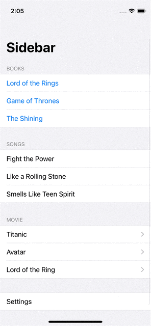
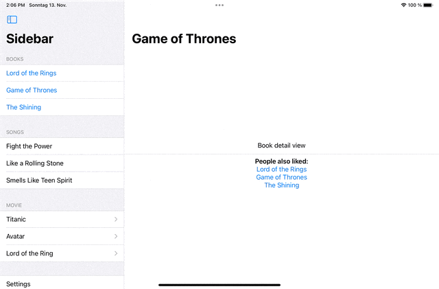
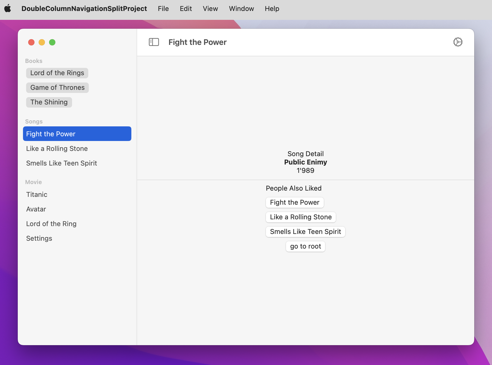

# DoubleColumnNavigationSplitProject
Expample Project for NavigationSplitView with 2 columns in SwiftUI for iOS 16 and macOS 13

The app is adapted for multiplatform use

## iPhone

    
## iPad

      
## mac

